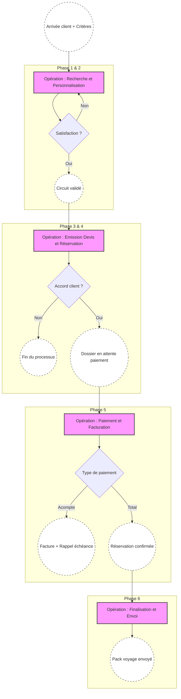

```mermaid
graph TD
    %% Evénements et Opérations
    E1((Arrivée client + Critères)):::event --> OP1
    
    subgraph "Phase 1 & 2"
    OP1[Opération : Recherche et Personnalisation]:::op
    OP1 --> R1{Satisfaction ?}
    R1 -- "Non" --> OP1
    R1 -- "Oui" --> E2((Circuit validé)):::event
    end

    E2 --> OP2
    subgraph "Phase 3 & 4"
    OP2[Opération : Emission Devis et Réservation]:::op
    OP2 --> R2{Accord client ?}
    R2 -- "Non" --> E3((Fin du processus)):::event
    R2 -- "Oui" --> E4((Dossier en attente paiement)):::event
    end

    E4 --> OP3
    subgraph "Phase 5"
    OP3[Opération : Paiement et Facturation]:::op
    OP3 --> R3{Type de paiement}
    R3 -- "Acompte" --> E5((Facture + Rappel échéance)):::event
    R3 -- "Total" --> E6((Réservation confirmée)):::event
    end

    E6 --> OP4
    subgraph "Phase 6"
    OP4[Opération : Finalisation et Envoi]:::op
    OP4 --> E7((Pack voyage envoyé)):::event
    end

    %% Styles
    classDef event fill:#fff,stroke:#333,stroke-dasharray: 5 5
    classDef op fill:#f9f,stroke:#333,stroke-width:2px
```
